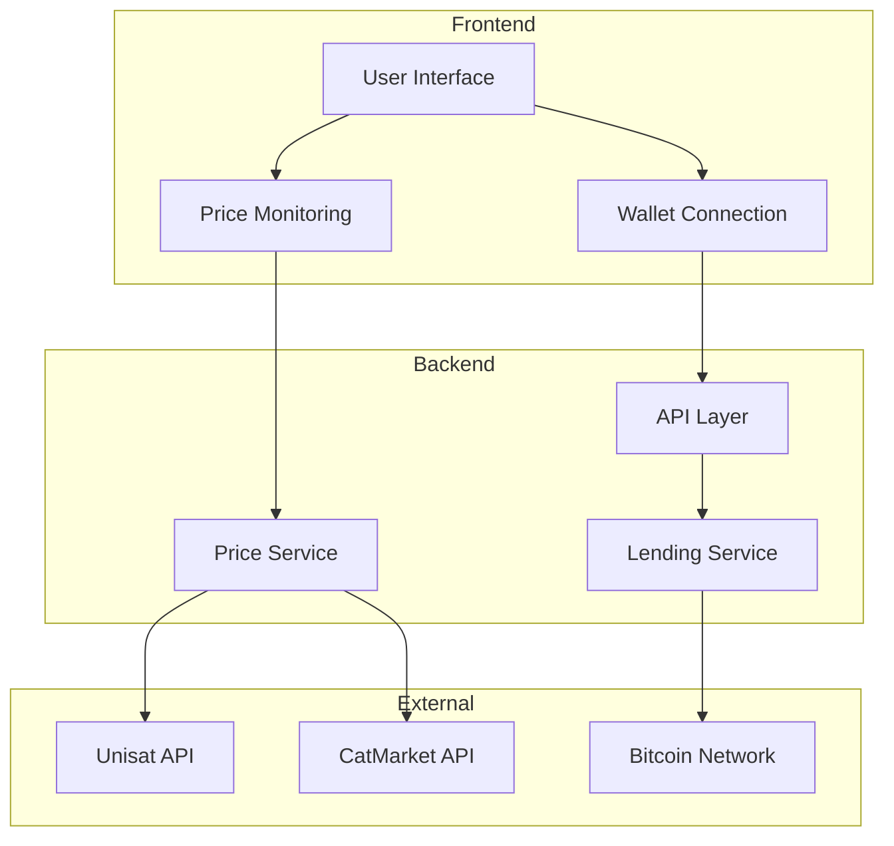

# FractalLend

> P2P Lending Protocol for Ordinals and CAT-20 Tokens on Fractal Bitcoin

## Overview

FractalLend is a decentralized lending protocol that enables Bitcoin Ordinal holders to borrow CAT-20 tokens using their Ordinals as collateral. The platform facilitates peer-to-peer lending while ensuring security through smart contract-based liquidation mechanisms.

## Problem Statement

1. **Limited Liquidity**: Ordinal holders often face challenges in accessing liquidity without selling their NFTs
2. **Underutilized Assets**: Valuable Ordinal collections lack utility beyond collection and trading
3. **Market Inefficiency**: No standardized platform for P2P lending using Bitcoin NFTs as collateral
4. **Risk Management**: Need for secure collateralization and liquidation mechanisms

## Solution

FractalLend addresses these challenges by:

- Creating a secure P2P lending marketplace for Ordinal holders
- Enabling CAT-20 token holders to earn yield by lending
- Implementing automated liquidation mechanisms to protect lenders
- Providing real-time price feeds for accurate collateral valuation

## Demo Video

https://www.youtube.com/watch?v=yENVOptUAUE

## Features

### For Borrowers
- Borrow CAT-20 tokens using Ordinals as collateral
- Multiple supported CAT-20 tokens (OPCAT, PSYOPCAT, SASHA)
- Up to 70% loan-to-value ratio
- 7-day fixed lending period
- Real-time liquidation price indicators
- Multi-step borrowing process with clear instructions

### For Lenders
- Lend CAT-20 tokens against verified Ordinal collections
- Earn interest on lending positions
- Automatic liquidation at 80% LTV
- Real-time floor price monitoring
- Collection verification status
- Social proof integration

## Architecture




## Technical Stack

### Frontend
- Next.js 14 (App Router)
- TypeScript
- TailwindCSS
- React Context for state management

### Backend Services
- Node.js
- TypeScript
- PostgreSQL
- Redis for caching

### APIs & Integration
- Unisat API for Ordinal data
- CatMarket API for CAT-20 pricing
- Bitcoin network integration

### Development Tools
- ESLint
- Prettier
- Husky for git hooks
- Jest for testing

## Getting Started

1. Clone the repository:
```bash
git clone https://github.com/kamalbuilds/fractallend.git
```

2. Install dependencies:
```bash
cd fractallend
npm install
```

3. Set up environment variables:
```bash
cp .env.example .env.local
```

4. Add your API keys:
```env
NEXT_PUBLIC_UNISAT_API_KEY=your_api_key_here
```

5. Run the development server:
```bash
npm run dev
```

## Contributing

We welcome contributions! Please see our [Contributing Guide](CONTRIBUTING.md) for details.

## Security

- 70% maximum loan-to-value ratio
- 80% liquidation threshold
- Real-time price monitoring
- Smart contract security audits
- Multi-step transaction verification

## License

MIT License - see [LICENSE](LICENSE) for details

## Contact

- Website: [fractallend.com](https://fractallend.com)
- Twitter: [@FractalLend](https://x.com/0xkamal7)
- Discord: [Join our community](https://discord.gg/fractallend)
```
